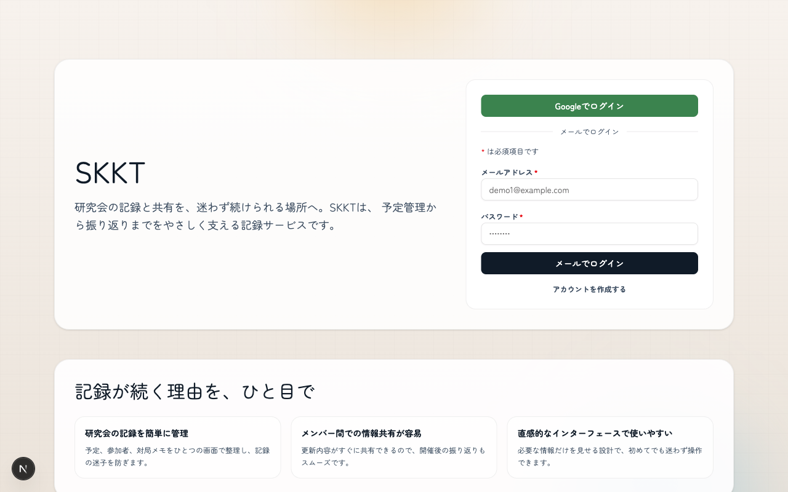
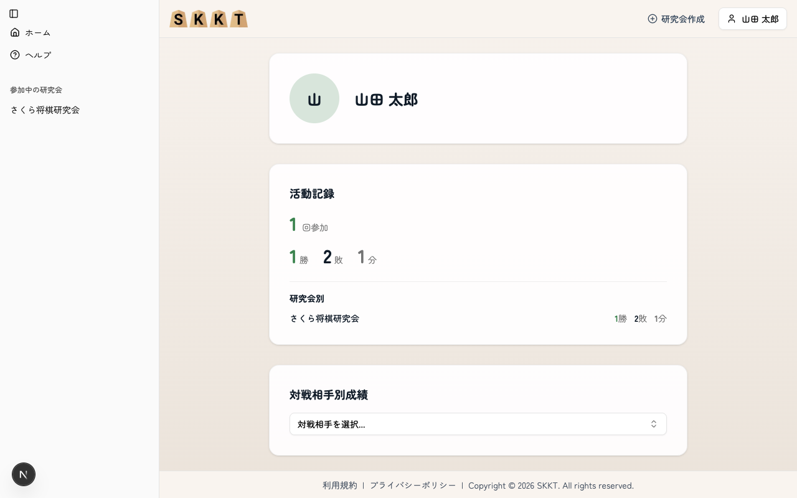
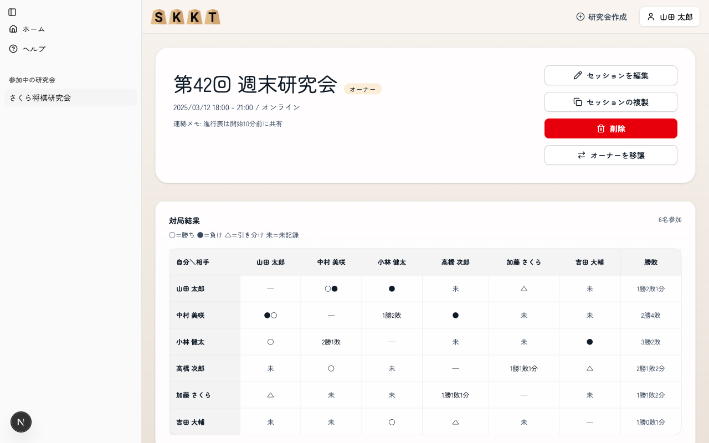
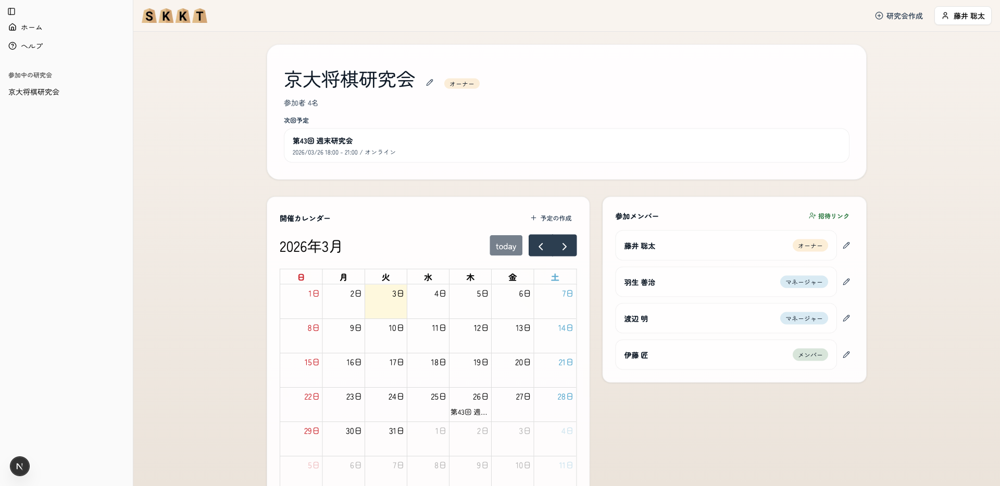

# SKKT

# デモ

トップ画面: 主要な導線や概要が見られるホーム画面。

ユーザー画面: ユーザー一覧と基本情報を確認できる画面。

セッション画面: セッションの一覧と詳細が確認できる画面。

サークル画面: サークルの一覧と詳細が確認できる画面。


# 使い方

まだリリース前なので開発者向け起動コマンドのみ示す。ホットリロードが機能する。

```bash
npm run dev
```

## 開発用DB/テスト

開発用のセットアップとテスト手順。

```bash
# Prisma migration
npx prisma migrate dev

# Seed
npx prisma db seed

# Type check
npx tsc --noEmit

# Tests
npx vitest
```

注意:

- `migrate reset` は全データ削除のため開発DBでのみ使用する
- Seedは `prisma/seed.ts` に定義している

## 開発時のログイン

- メール+パスワードでログインする場合は `http://localhost:3000/signup` からアカウントを作成する
- 作成後はトップ画面のフォームからサインインできる
- `npm run db:reset` でシードした場合のロール別確認用アカウント
- 対象の研究会: 「京大将棋研究会」（circleId: `demo`）
- 対象の開催回: 「第42回 週末研究会」（circleSessionId: `demo-session-42`）
- 研究会オーナー: sota@example.com / demo-pass-1
- 研究会マネージャー: hanyu@example.com / demo-pass-2, watanabe@example.com / demo-pass-3
- 研究会メンバー: ito@example.com / demo-pass-4
- 開催回オーナー（`demo-session-42`）: sota@example.com / demo-pass-1
- 開催回マネージャー（`demo-session-42`）: toyoshima@example.com / demo-pass-5, nagase@example.com / demo-pass-6
- 開催回メンバー（`demo-session-42`）: sasaki@example.com / demo-pass-7, sugai@example.com / demo-pass-8
- 変更時は `prisma/seed.ts` の `demoUsers` とあわせて更新する

# 使用している技術・ライブラリ・フレームワーク

TypeScript
React
Next.js
Prisma
NextAuth.js
Tailwind CSS
ESlint
Zod
Vitest
Prettier
shadcn/ui
