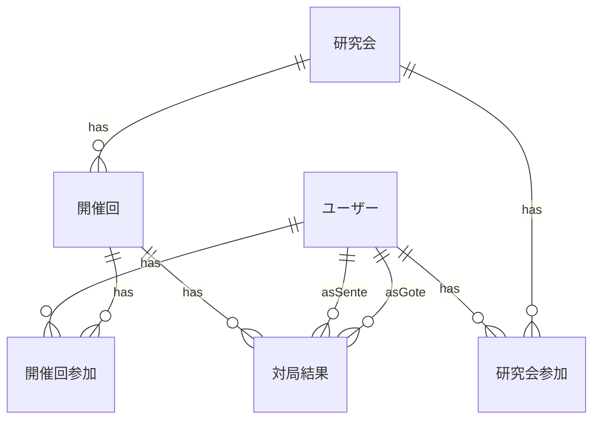

### 1. 関係の要約（文章）

- 研究会は複数の開催回を持つ
- ユーザーは複数の研究会に参加でき、研究会ごとにロールを持つ
- ユーザーは複数の開催回に参加でき、開催回ごとにロールを持つ
- 開催回には複数のユーザーが参加できる
- 開催回の参加者は研究会の参加者である必要はない
- 対局結果は開催回に属し、**1 局 = 1 対局結果**とする
- 同一開催回・同一対局者ペアで複数の対局結果を許容する
- **開催回参加者 ⊇ 対局者** の制約を持つ

### 2. ER 図（参考・補助）

