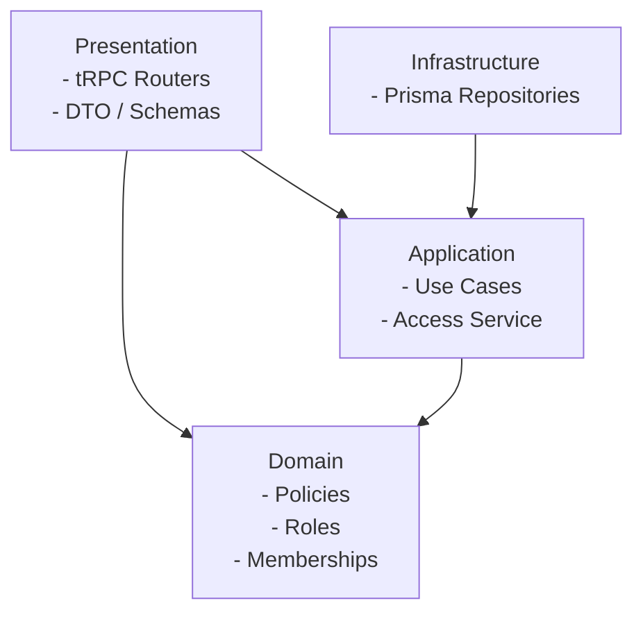

# レイヤ構成と責務

## 目的

本ドキュメントは、DDD に基づくレイヤ構成と責務分担を明確にする。

## レイヤ構成

- Presentation（プレゼンテーション）
  - API の入出力設計（DTO / Zod スキーマ）
  - ルーティング（tRPC Router）
  - ドメインモデルとの変換（DTO マッパー）
- Domain（ドメイン）
  - 不変条件・ポリシー・値オブジェクトなどの純粋ロジック
  - 外部依存を持たない
  - Repository interface（ポート）を定義する
  - User ドメインモデルを配置し、名前の取り扱いは任意とする
- Application（アプリケーション）
  - ユースケース実行（トランザクション境界を含む）
  - ドメインロジックを組み合わせる
- Infrastructure（インフラ）
  - DB や外部サービスとの接続
  - リポジトリ実装（取得/永続化のみ）

## 依存関係

- Presentation は Application / Domain に依存する
- Domain は他層に依存しない
- Application は Domain に依存する
- Infrastructure は Application のポートに依存する
- Composition Root（Presentation）は Infrastructure を参照して依存を組み立てる

## 構成図（概念）

## 現状の配置例

- Presentation
  - `server/presentation/dto/*`
  - `server/presentation/mappers/*`
  - `server/presentation/trpc/*`
  - `app/api/trpc/[trpc]/route.ts`
- Domain
  - `server/domain/services/authz/roles.ts`
  - `server/domain/services/authz/policies.ts`
  - `server/domain/services/authz/memberships.ts`
  - `server/domain/models/*/*-repository.ts`
  - `server/domain/services/*/*-repository.ts`
  - `server/domain/models/user/*`（User ドメインモデル）
- Application
  - `server/application/authz/access-service.ts`
  - `server/application/service-container.ts`（Service Container の factory）
- Infrastructure
  - `server/infrastructure/repository/authz/prisma-authz-repository.ts`

## 注意点

- リポジトリは「ルールの判断」を行わない
- ドメインロジックは I/O を持たない
- ルールに依存する更新はアプリケーション層でトランザクションを張る
- Composition Root は Presentation に配置し、Infrastructure を参照して配線する

## リポジトリ層のクエリフィルタリング方針

- 論理削除対応モデル（Match, CircleMembership, CircleSessionMembership）のリポジトリは、デフォルトで `deletedAt IS NULL` 条件を付与する
- 論理削除済みレコードを含めて取得する必要がある場合は、明示的なオプション指定（例: `includeDeleted: true`）を使用する

## 削除戦略

業務上の削除操作と、インフラ層での実装戦略の対応を以下に示す。業務ルールの定義は `02_business_rules.md` を参照。

| 業務操作 | 削除戦略 | 補足 |
|---------|---------|------|
| 研究会削除 | 物理削除（カスケード） | 論理削除済みレコードを含む配下データがすべて物理削除される |
| 研究会メンバーの脱退・除名 | 論理削除（`deletedAt`） | |
| セッション参加取消 | 論理削除（`deletedAt`） | |
| 対局結果の削除 | 論理削除（`deletedAt`） | |

## 認可の実装ルール

- API 層は `getSessionUserId()` でアクターを取得し、アクター ID はリクエストボディで受け取らない
- 認可判定は Application Service 内で行い、`accessService` を必ず経由する
- 存在チェックは Application Service が担当し、見つからない場合は `"* not found"` を返す
- 認可失敗は `"Forbidden"` を返し、Presentation 層のエラーマッピング（`server/presentation/trpc/errors.ts`）で変換する
- Repository / Mapper は認可判定を持たない
- 具体的な許可/不許可の判断基準は `docs/design/04_access_policy.md` を唯一の参照とする
