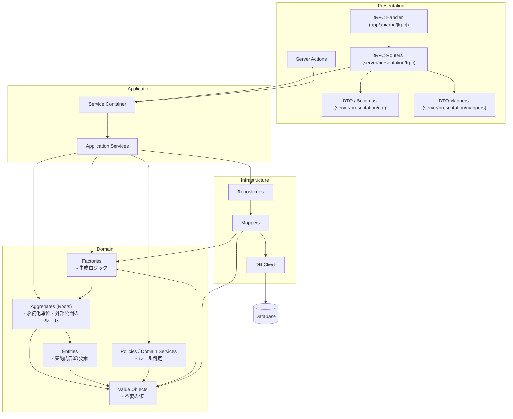
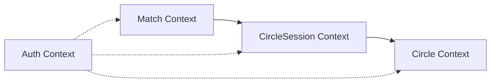

# アーキテクチャ概要図

## 目的

DDD ベースのレイヤ構成とコンテキスト関係を可視化する。レイヤードアーキテクチャを採用する。

## レイヤ構成

## Bounded Context の関係

## 実装上の配置（参考）

- Presentation
  - `app/api/trpc/[trpc]/route.ts`
  - `server/presentation/*`
  - `app/api/auth/[...nextauth]/route.ts`
- Application
  - `server/application/*`
  - `server/application/service-container.ts`（現状の Composition Root）
- Domain
  - `server/domain/models/*`
  - `server/domain/models/*/*-repository.ts`
  - `server/domain/services/*`
  - `server/domain/services/*/*-repository.ts`
  - `server/domain/common/*`
- Infrastructure
  - `server/infrastructure/repository/*`
  - `server/infrastructure/mappers/*`
  - `server/infrastructure/db.ts`

## 補足

- リポジトリはマッパー経由で Prisma と接続する方針（Authz 含む）
- Composition Root は依存関係逆転の対応で Infrastructure へ移動予定
